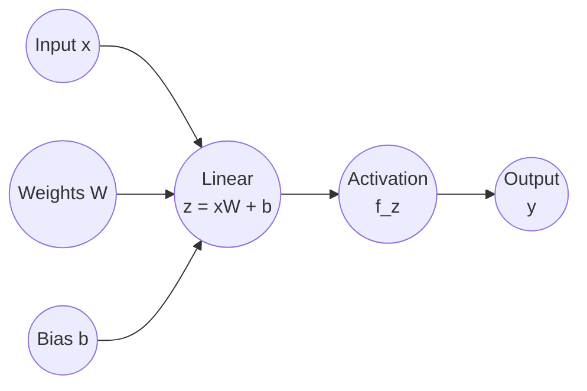

# Activation

In deep learning, an **activation** is the numerical output of a single neuron (or an entire layer) after it has processed its input. It represents the "signal" that is passed forward to the next layer in the network.

If you think of a neural network as a series of gates, the **activation** value tells you how much a specific "gate" has opened in response to the data it just saw.

## Visual of a Single Neuron or Perceptron

## 🔢 The Mathematical Process

An activation is the result of a two-step process within a neuron:

1.  **The Weighted Sum (Pre-activation):** The neuron takes its inputs ($x$), multiplies them by weights ($w$), and adds a bias ($b$). This is a linear operation.

    $$z = \sum (w_i \cdot x_i) + b$$

2.  **The Activation Function:** This linear result ($z$) is then passed through a non-linear **activation function** (like ReLU or Sigmoid). The final result is the **activation ($a$)**.

    $$a = \sigma(z)$$

## 🧠 Why is it called "Activation"?

The term is borrowed from **biology**. In the human brain, biological neurons stay "quiet" until they receive enough chemical or electrical signals from other neurons to reach a certain threshold. Once that threshold is hit, the neuron **"fires"** (activates) an electrical pulse to its neighbors.

In deep learning:
* **High Activation:** The neuron has detected a feature it was looking for (e.g., a vertical line in an image) and is sending a "strong" signal to the next layer.
* **Low/Zero Activation:** The neuron did not find its specific feature and is remaining "quiet."

## 🎯 Significance of Activations

* **Feature Representation:** Activations are how the network "describes" the input. In an image-processing network, the activations in the first layer might represent edges, while activations in deeper layers might represent complex shapes like eyes or wheels.
* **Sparsity:** Functions like **ReLU** produce "sparse activations," meaning many neurons stay at $0$. This is computationally efficient and helps the network focus on only the most important features.
* **Gradient Flow:** During backpropagation, the derivative of the activation is used to calculate how to update the weights. If the activation is "saturated" (stuck at a value where the slope is zero), the network stops learning.

---

# Activation Functions

The purpose of an **activation function** is to introduce **non-linearity** into a neural network. Without them, a neural network—no matter how many layers it has—would behave exactly like a simple linear regression model.

Here is why they are considered the "engine" of deep learning.

## 1. The Mathematical Problem: Linear Collapse
In a neural network, each layer performs a linear operation: $Z = Wx + b$. If you stack multiple linear layers together without an activation function, the math "collapses."

Mathematically, a linear function of a linear function is still just a linear function. 

* **Layer 1:**

  $y_1 = W_1x$

* **Layer 2:**

  $y_2 = W_2y_1 \rightarrow y_2 = W_2(W_1x) \rightarrow y_2 = (W_2W_1)x$

This means a 100-layer network with no activation functions is mathematically identical to a **1-layer network**. It can only learn straight-line relationships.

## 2. Learning Complex Patterns
Real-world data is rarely linear. Features like the curve of an eye in a photo, the sentiment in a sentence, or the fluctuations in the stock market are highly complex and non-linear.

Activation functions allow the network to "bend" the linear inputs. By applying a non-linear function (like **ReLU** or **Sigmoid**), the network can create complex decision boundaries that can wrap around data points, rather than just cutting through them with a straight line.

## 3. The Universal Approximation Theorem
This is a core principle in AI: a neural network with at least one hidden layer and a non-linear activation function can (theoretically) represent **any** continuous function. 

This is what makes Deep Learning "Deep." The activation functions allow the network to break down a massive, complex problem into millions of tiny, non-linear pieces that eventually combine to solve the task.

## 4. Signal Control (Gating)
Activation functions act as a gatekeeper. They decide:
* **Should this neuron fire?** (In the case of **ReLU**, if the input is negative, the output is zero—the neuron is "turned off").
* **What is the intensity?** (In the case of **Sigmoid**, it squashes values between 0 and 1, essentially giving a probability).

## 🎯 Summary of Common Functions

The *type* of activation function used determines the range and behavior of the activations.

* **ReLU (Rectified Linear Unit):** The most common for hidden layers. If the input is negative, the activation is $0$. If positive, the activation is the input itself. 
* **Sigmoid:** Squashes the activation to a range between $0$ and $1$. Often used for binary probability.
* **Softmax:** Used in the final layer of a classifier. It turns the raw outputs into a set of probabilities that sum to $1$.

| Function | Shape | Best Used For... |
| :--- | :--- | :--- |
| **ReLU** | A "hinge" at 0 | **Hidden Layers.** It's fast and prevents the network from "stalling" during training. |
| **Sigmoid** | An "S" curve (0 to 1) | **Binary Classification.** It's great for predicting "Yes" or "No" (probabilities). |
| **Softmax** | Multiple "S" curves | **Multi-class Classification.** It ensures all output probabilities sum to 100%. |

