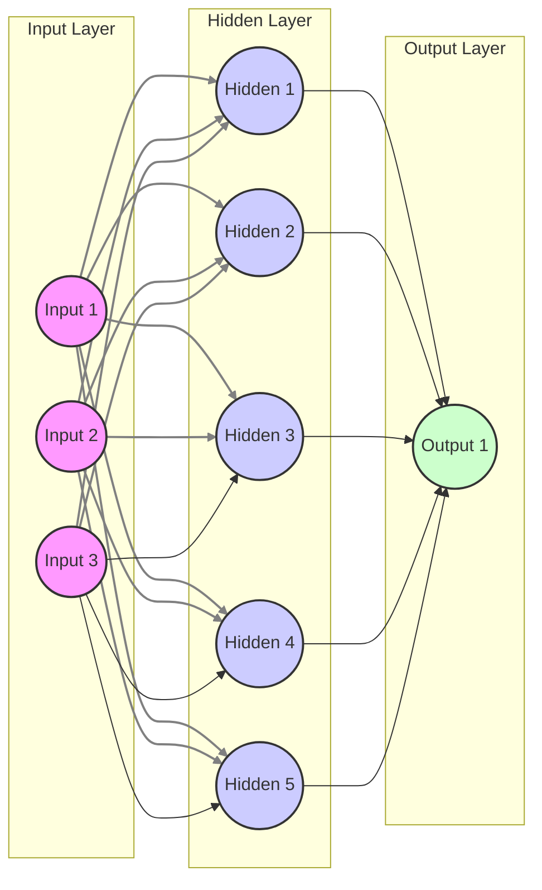
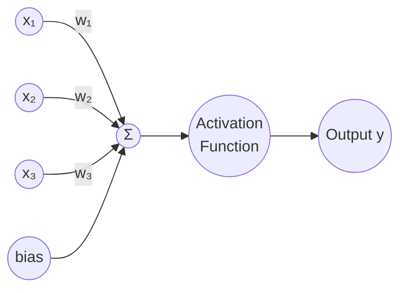

# Deep Learning: What is a Forward Pass?

In Deep Learning, a **forward pass** (also known as **forward propagation**) is the process where input data travels through the layers of a neural network to produce an output or "prediction."

Think of it as the network's "inference" phase—it is the step where the model actually looks at the data and makes a guess before any learning or correction happens.

## How it Works: Step-by-Step
During a forward pass, data flows in one direction: from the **Input Layer**, through one or more **Hidden Layers**, to the **Output Layer**.

At every single neuron in the network, two main mathematical operations occur:

1.  **The Weighted Sum ($z$):** Each input is multiplied by a "weight" (importance) and a "bias" (offset) is added.
    $$z = \sum (weight \times input) + bias$$
2.  **The Activation Function ($a$):** This result ($z$) is passed through a non-linear function like **ReLU** or **Sigmoid**. This allows the network to learn complex patterns rather than just simple linear relationships.
    $$a = \sigma(z)$$

## The Forward Pass in the Training Cycle
In the context of training a model, the forward pass is only the first half of the story. The full cycle looks like this:

| Step | Phase | Action |
| :--- | :--- | :--- |
| **1** | **Forward Pass** | Input data goes in $\rightarrow$ Prediction comes out. |
| **2** | **Loss Calculation** | The prediction is compared to the "correct" answer to see how wrong it was (the "Loss"). |
| **3** | **Backward Pass** | The error is sent back through the network to calculate how much each weight contributed to the mistake. |
| **4** | **Optimizer Step** | Weights are updated slightly to reduce the error for the next time. |

## Key Takeaways
* **Direction:** It always moves from left to right (Input $\rightarrow$ Output).
* **Purpose:** To generate a prediction or calculate the current "loss."
* **Inference vs. Training:** When you use a finished model (like ChatGPT or FaceID), it *only* performs a forward pass. The backward pass is only used during the training phase to help the model learn.

---

# APPENDIX

## Forward propagation in Neural Network

## Perception

### What this represents
* **x₁, x₂, x₃:** Input features
* **w₁, w₂, w₃:** Weights (shown on edges)
* **bias:** Bias term added to the weighted sum
* **Σ:** Linear combination

z = $∑w_i​x_i$ + b

* **Activation:** Applies a function (e.g., step, sigmoid, ReLU)
* **Output y:** Final perceptron output

