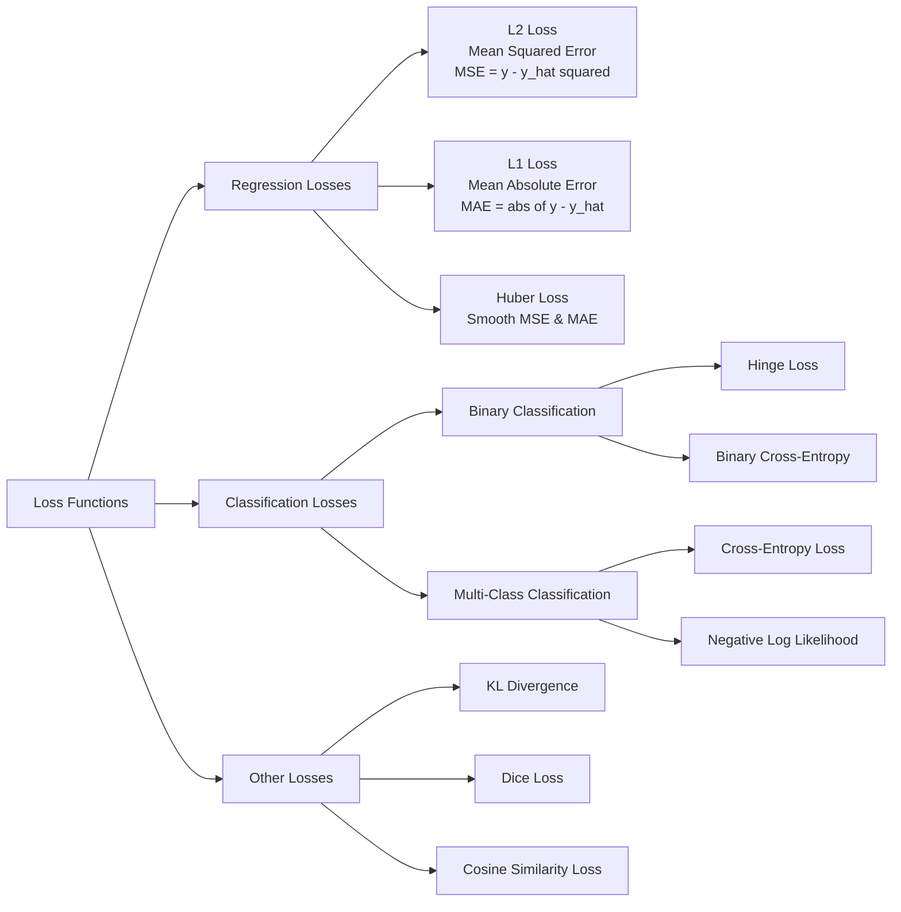

# Loss Function

A **loss function** (also known as a cost function or objective function) is a mathematical formula that measures the "distance" between your model's prediction and the actual ground truth. 

Think of it as a **scoring system**: it assigns a high penalty (high loss) when the model is very wrong and a low score (low loss) when the model is accurate. It is the single most important feedback mechanism in machine learning.

## 📐 What is it Mathematically?

If $\hat{y}$ is the model's prediction and $y$ is the actual target value, the loss function $L$ is expressed as:

$$L(y, \hat{y})$$

For example, in a simple **Mean Squared Error (MSE)** loss, the math looks like this:

$$MSE = \frac{1}{n} \sum_{i=1}^{n} (y_i - \hat{y}_i)^2$$

## 🌟 Why is it Important?

Without a loss function, a neural network has no way of knowing if it is improving. Its importance can be broken down into three roles:

* **Defining the Goal:** It translates a real-world goal (like "identify cats in photos") into a mathematical value that a computer can minimize.
* **The "Compass" for Learning:** It provides the direction for optimization. The loss surface tells the model which way to "walk" (adjust weights) to get closer to the truth.
* **Error Attribution:** It quantifies exactly how much each specific error should matter. For instance, some loss functions penalize huge outliers heavily, while others are more "forgiving."

## 🔄 How is it Used in the Training Loop?

The loss function is the bridge between the **Forward Pass** and the **Backward Pass**. Here is the step-by-step cycle:

1.  **Forward Pass:** The model takes an input and makes a prediction ($\hat{y}$).
2.  **Calculate Loss:** The loss function compares $\hat{y}$ to the real label ($y$) and outputs a single number (e.g., $Loss = 0.85$).
3.  **Backpropagation:** The network calculates the **gradient** (derivative) of that loss. This tells the model: *"To make this 0.85 go down to 0.80, I need to slightly increase this weight and decrease that one."*
4.  **Optimization:** An optimizer (like SGD or Adam) uses that information to actually update the weights.

## 📊 Common Loss Functions at a Glance

Choosing the right loss function depends entirely on the type of problem you are solving.

| Task Type | Common Loss Function | Best For... |
| :--- | :--- | :--- |
| **Regression** | **Mean Squared Error (MSE)** | Predicting continuous numbers (prices, temperature). |
| **Binary Classification** | **Binary Cross-Entropy** | Yes/No questions (Spam vs. Not Spam). |
| **Multi-Class Classification** | **Categorical Cross-Entropy** | Choosing one from many (Dog vs. Cat vs. Bird). |
| **Object Detection** | **Huber Loss** | Predicting coordinates where outliers might exist. |

> **Key Takeaway:** You can think of the **Model** as the student, the **Dataset** as the textbook, and the **Loss Function** as the teacher’s red pen. The red pen doesn't give the answers; it just marks where the student was wrong so they can do better next time.
