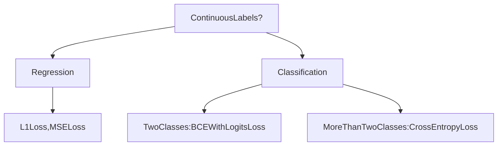

# Training Deep Networks

Training Deep Networks have **three major components:**
* **Optimizer** + Training objective (**Loss**): A `Loss` is a function that tells a deep network whther it follows the data or not follow the data.
  - Generally, two types of Loss - Supervised vs. Unsupervised, Generative vs Discriminative modeling - not much difference as far as loss is concerned. 
* **Architecture:** This Transformers, CNNs, MLPs, etc. The weights of these architectures is what we want to train.
* **Dataset:** Gigantic collection of either images with labels, or just text with inputs and expected outputs, audio, etc. 

## Loss Function

