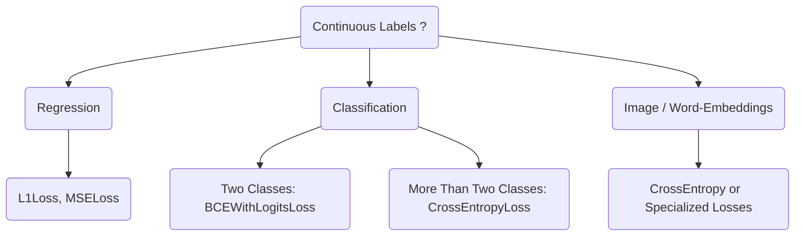

# Training Deep Networks

**Training a Deep Network** is effectively an optimization problem. It is the process of finding the specific set of parameters $\theta$ (weights and biases) that minimizes the error between the model's predictions and the actual ground truth.

Training Deep Networks have **three major components:**
* **Optimizer** + Training objective (**Loss**): A `Loss` is a function that tells a deep network whther it follows the data or not follow the data.
  - Generally, two types of Loss - Supervised vs. Unsupervised, Generative vs Discriminative modeling - not much difference as far as loss is concerned. 
* **Architecture:** This Transformers, CNNs, MLPs, etc. The weights of these architectures is what we want to train.
* **Dataset:** Gigantic collection of either images with labels, or just text with inputs and expected outputs, audio, etc. 

## Loss Function

The Loss Function $\mathcal{L}$ is the mathematical formula that calculates "how wrong" the model is.

Types of Loss Functions commonly used:

### Example: Mathematical Formula (Cross-Entropy)
For a single example with correct class $c$:

$$\mathcal{L}(\theta) = -\log\left( \frac{e^{f_c}}{\sum_{j} e^{f_j}} \right)$$

Where:
* $f_c$ is the raw output score (logit) for the correct class.
* The term inside the $\log$ is the **Softmax** probability.
* $\theta$ represents all weights in the network.

If the model predicts the correct class with probability 1.0, Loss = 0.
If it predicts 0.0, Loss = $\infty$.

---
## Training Objective

The **training objective** is to minimize a Loss L($\theta$). 

**L($\theta$)** is the output of the deep network $f_\theta(x, y)$ (or l($\theta$|x,y) ), where 'y' is some label, over the 'expectation': 

$L(\theta) = E_{x,y~D}[ l(f_\theta(x),y) ]$

Minimize Loss using `gradient descent`. Compute the 'gradient' using computed differentiation.

The training algorithm repeats the following cycle (often millions of times) until the loss stops decreasing.

1.  **Sample:** Grab a "Batch" of data (e.g., 32 images).
2.  **Forward Pass:** Pass data through the network to get predictions.
3.  **Loss Calculation:** Compare predictions to truth using $\mathcal{L}$.
4.  **Backward Pass (Backprop):** Calculate the gradient $\nabla_\theta \mathcal{L}$. This tells us the *direction* to move each weight to reduce the error.
5.  **Optimizer Step (AdamW):** Update the weights using the calculated gradients.

---

## 3. The Algorithm: AdamW

**AdamW** (Adam with Decoupled Weight Decay) is currently the industry standard optimizer (used by GPT-4, Llama, etc.). It combines **Momentum** (velocity), **RMSProp** (adaptive scaling), and **Weight Decay** (regularization) cleanly.

Here is the step-by-step mathematical algorithm for a single update at time step $t$:

### Inputs:
* $\alpha$: Learning Rate (step size).
* $\beta_1, \beta_2$: Decay rates (usually 0.9, 0.999).
* $\lambda$: Weight Decay coefficient.
* $\epsilon$: Small number for stability ($10^{-8}$).
* $g_t$: Gradient computed from backprop ($\nabla_\theta \mathcal{L}$).

### The Update Steps:

**Step 1: Decoupled Weight Decay**
First, decay the weights directly. This keeps them small and prevents overfitting.

$$\theta_{t} \leftarrow \theta_{t-1} - \alpha \lambda \theta_{t-1}$$

**Step 2: Update Momentum (First Moment)**
Calculate the rolling average of gradients (like a heavy ball gaining speed).

$$m_t \leftarrow \beta_1 m_{t-1} + (1 - \beta_1) g_t$$

**Step 3: Update Variance (Second Moment)**
Calculate the rolling average of *squared* gradients to gauge volatility.

$$v_t \leftarrow \beta_2 v_{t-1} + (1 - \beta_2) g_t^2$$

**Step 4: Bias Correction**
Adam initializes $m$ and $v$ at 0, so early steps are biased toward 0. We fix this:

$$\hat{m}_t \leftarrow \frac{m_t}{1 - \beta_1^t}, \quad \hat{v}_t \leftarrow \frac{v_t}{1 - \beta_2^t}$$

**Step 5: Parameter Update**
Finally, move the weights in the direction of momentum, scaled by the variance.

$$\theta_t \leftarrow \theta_t - \alpha \frac{\hat{m}_t}{\sqrt{\hat{v}_t} + \epsilon}$$

### Algorithm for Adam / AdamW 

m, v, t = 0, 0, 1    

for epoch in range(n):

&emsp; for (x, y) in dataset:

&emsp;&emsp; J = $\nabla$ l ($\theta$ | x, y)
  
&emsp;&emsp; m = (1 - $\beta_1$) * J + $\beta_1$ * m

&emsp;&emsp; v = $\beta_2$ * v + (1 - $\beta_2$) * J.square()

&emsp;&emsp; m = m / (1 - $\beta_1$^t)

&emsp;&emsp; v = v / (1 - $\beta_2$^t)

&emsp;&emsp; $\theta$ = $\theta$ - $\epsilon$ * (m / v.sqrt() + decay * $\theta$ ) 
  
&emsp;&emsp; t += 1

**Discussion (refer to AdamW Algorithm above):**
* Adam is special because the optimizer itself also has parameters. The optimizer has **more parameters** than the model has.
  - if model has **n** parameters, AdamW add **2n** parameters, and the gradient itself has **n** values in it.
  - e.g., if model has 100,000 paramaters, AdamW adds 200,000 parameters to this 100,000 model parameters, and the Gradient adds 100,000 parameters.
  - **Overall, Adam/AdamW will have four floating point values per parameter.** *This becomes a problem when training very large models.*
* The additional parameters are to keep track of the **first momentum term** - `m` and a **second momentum term** - `v`
  - m, v, t = 0, 0, 1 
* 'J' is the `Gradient`
  - J = $\nabla$ l ($\theta$ | x, y)
* `m` is the weighted average of past gradients
  - m = (1 - $\beta_1$) * J + $\beta_1$ * m
* `v` is the weighted average of the square of the gradient (i.e. the magnitude of the gradient).
  - v = $\beta_2$ * v + (1 - $\beta_2$) * J.square()
* The weighted average are normalized in the folowing two lines in the algorithm to ensure that **the weighted averages doesn't start out as zero**.
  - m = m / (1 - $\beta_1$^t)
  - v = v / (1 - $\beta_2$^t)
* Take a gradient step in the direction of this accumulated gradient and normalize it by the magnitude of this gradient - `v.sqrt()`
  - $\theta$ = $\theta$ - $\epsilon$ * (m / v.sqrt() + decay * $\theta$ )
  - Sometime for AdamW, there is **weight decay term** to ensure **the weights don't grow unbounded**.

---

### Why AdamW?
Standard **Adam** tries to fold Weight Decay into the gradient ($g_t$), which messes up the adaptive math. **AdamW** separates them (Step 1), leading to significantly better generalization for Deep Networks.

